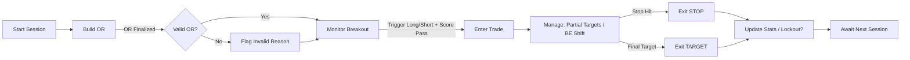

# ORB Confluence Breakout Trading Strategy – Technical Specification

Version: 1.0  
Primary Focus: Detailed specification of the trading strategy itself (logic, assets, data sourcing, analytics requirements) to drive Python implementation first, followed by a TypeScript/TSX dashboard phase.  
Scope: Intraday Opening Range Breakout (ORB) strategy with multi-factor confluence, institutional risk governance, and extensible factor framework.  

---

## 1. Strategy Purpose & Philosophy

The strategy aims to exploit statistically favorable intraday directional extensions *following* a well-formed Opening Range (OR) in liquid US futures contracts. It avoids impulsive/low-participation breakouts by enforcing:
- **Range quality filters** (volatility-normalized OR width)
- **Contextual alignment** (prior day structure proxy / VWAP / trend regime)
- **Participation confirmation** (relative volume)
- **Price intent** (structure or engulfing confirmation)
- **Risk discipline** (predefined initial risk, partials, breakeven shift, daily governance)

It is designed for:
- Consistent daily execution
- Low trade frequency (0–3 entries per instrument)
- Transparent attribution (why a signal fired)
- Cross-session robustness (trend vs choppy days)

---

## 2. Target Instruments

| Symbol | Contract (E-mini / Micro) | Exchange | Tick Size | Tick Value | Point Value | Typical RTH Session (CT) | Notes |
|--------|---------------------------|----------|-----------|-----------:|-----------:|--------------------------|-------|
| ES / MES | S&P 500 Index | CME | 0.25 | $12.50 (MES $1.25) | $50 (MES $5) | 08:30–15:00 | High liquidity, broad sentiment proxy |
| NQ / MNQ | Nasdaq 100 Index | CME | 0.25 | $5.00 (MNQ $0.50) | $20 (MNQ $2) | 08:30–15:00 | Higher volatility—adjust buffers |
| CL / MCL | WTI Crude Oil | NYMEX | 0.01 | $10 (MCL $1) | $1,000 per full point | 08:00–13:30 | Event/news-sensitive |
| GC / MGC | Gold | COMEX | 0.10 | $10 (MGC $1) | $100 per full point | 07:20–12:30 | Gaps, macro-sensitive |
| 6E / M6E | Euro FX | CME | 0.00005 | $6.25 (M6E $1.25) | $125 per 0.0100 | 07:20–14:00 | Smoother trend phases |
| Optional: RTY, ZN, ZB | Russell / Treasuries | CME/CBOT | Varies | Varies | Varies | 08:30 RTH (equities) | Add after core validation |

**Priority Implementation Order:** MNQ (micro), MES, ES, NQ → then CL / GC → then currency/others.  
**Multi-Instrument Risk:** Later phases may apply correlation & beta-weighting.

---

## 3. Sessions & Time Handling

- Internal canonical timezone: **UTC**.  
- Each instrument assigned a **Session Template**:
  - Equities: 08:30–15:00 CT (Exclude last 15 min for new entries).
  - CL: 08:00–13:30 CT.
  - GC / 6E: Use exchange RTH template; ensure prior day boundaries are consistent.
- Overnight (ETH) ignored for OR construction (unless future extension adds pre-market regime logic).
- **Day boundary** = first RTH bar timestamp for the instrument’s session.

---

## 4. Opening Range (ORB) Logic

### 4.1 OR Duration
Adaptive selection:
- Compute `normalized_vol = ATR_intraday(window=14, tf=chosen_intraday) / ATR_daily(window=14)`
- If `normalized_vol < low_threshold` → OR length = 10 minutes
- Else if `normalized_vol > high_threshold` → OR length = 30 minutes
- Else → OR length = base (default 15 minutes)

### 4.2 OR Construction
- Accumulate `ORHigh = max(high)` and `ORLow = min(low)` over OR window bars.
- Finalize at OR end timestamp (strict cutoff: bars with open time < end included).

### 4.3 Width & Validity
- `ORWidth = ORHigh - ORLow`
- Compare to volatility band:  
  `minWidth = min_atr_mult * ATR(lookback=atr_period, base_tf)`  
  `maxWidth = max_atr_mult * ATR(...)`
- Valid if: `minWidth <= ORWidth <= maxWidth`
- Reasons flagged: `TooNarrow`, `TooWide`, else `Valid`.

### 4.4 Buffers
- Base buffer: fixed per instrument or parameter (e.g., 0.5 ES, 2.0 NQ).
- Optional ATR component: `dynamic_addition = ATR * atr_buffer_mult`
- Applied symmetrically:  
  - Long trigger threshold: `ORHigh + buffer`
  - Short trigger threshold: `ORLow - buffer`

---

## 5. Confluence Factors

| Factor | Definition | Long Pass | Short Pass | Params |
|--------|------------|-----------|------------|--------|
| Relative Volume | `relVol = currVol / SMA(vol, L)` | `relVol > spike_mult` | same | lookback, spike_mult |
| Price Action Pattern | Engulfing OR structure (HH/HL or LL/LH) | Engulf or recent HH/HL | Engulf or LL/LH | pivot_len |
| Profile Proxy (Prev Day) | Prior day quartiles: VAL ~ 25%, VAH ~ 75%, mid | Close > VAH or (ORHigh > VAH & Close > mid) | Close < VAL or (ORLow < VAL & Close < mid) | None |
| VWAP Alignment (session) | Running VWAP from session start | Close > VWAP | Close < VWAP | optional |
| ADX Trend Regime | Manual DI+/DI- smoothing | ADX > threshold | ADX > threshold | period, threshold |
| (Future) Delta / Order Flow | Cumulative delta confirming directional drive | Delta making HH with price | Delta making LL with price | feed integration |
| (Future) News Quiet Period | Exclude bars around events | Avoid signals in embargo | Avoid | event calendar |

**Engulfing Definition (Bullish):** `close > high[1] AND open <= close[1]` (mirror for bearish).  
**Structure:** Up bias if `high > highest(high[1..n]) AND low > lowest(low[1..n])`.  

---

## 6. Confluence Scoring

Pseudo:

```python
score_long = (
  w_price_action * price_action_long_pass +
  w_rel_vol      * rel_vol_spike +
  w_profile      * profile_long_pass +
  w_vwap         * vwap_long_pass +
  w_adx          * adx_pass_long
)

score_needed = base_required if not trend_weak else weak_trend_required
signal_long_allowed = (score_long >= score_needed)
```

- All weights typically default to 1 (allow tuning).
- Use binary (0/1) factor flags; consider future continuous scaling (e.g. scaled relVol).
- Log each factor’s state for dataset: `factor_matrix`.

---

## 7. Breakout Signal Logic

| Step | Condition |
|------|-----------|
| 1 | OR finalized & (valid OR or filter disabled) |
| 2 | Not locked out (daily governance) |
| 3 | Price crosses threshold (intrabar check using high/low) |
| 4 | Confluence scoring passes |
| 5 | No active trade (single concurrent position) |
| 6 | Within allowed time window (e.g., before midday cutoff) |

**Second-Chance Retest:**  
If first breakout fails to trigger or no confluence, allow re-attempt within `X` minutes after OR end if price retests and re-breaks threshold.

---

## 8. Trade Construction

### 8.1 Entry
- Benchmark entry price = breakout threshold (OR edge + buffer).
- Execution model (backtest):
  - Conservative fill rule: if both stop & target touched in same bar, assume stop first (unless modeling a sub-bar timeline).

### 8.2 Stop Placement Modes
| Mode | Logic |
|------|-------|
| OR_Opposite | Opposite OR boundary ± extraStopBuffer |
| Swing | Last localized pivot (pivot_len bars) ± buffer |
| ATR_Capped | Structural stop but capped to `max_dist = atr_stop_cap_mult * ATR` |

### 8.3 Targets
- If partials ON:
  - T1 = 1.0R (50%)
  - T2 = 1.5R (25%)
  - Runner = runnerRR * R (25%)
- If partials OFF: All-out at primary RR (e.g., 1.5R)
- R = `abs(entry_price - stop_price)`.

### 8.4 Breakeven Logic
- Move stop to entry after `move_to_be_at_R` (default 1.0R) OR after target1 fill.

### 8.5 Exit Reasons
- Stop, Final Target, (optional) Time Expiry (future extension), Governance flatten (halt new entries but allow open trade management).

---

## 9. Governance & Discipline

| Control | Rule | Purpose |
|---------|------|---------|
| Daily Signals Cap | Max signals per instrument or global | Avoid overtrading |
| Consecutive Loss Lockout | Stop generating signals after N full-stop losses | Prevent behavioral cascading |
| Time Cutoff | No new entries after defined HH:MM (e.g., 13:30 CT) | Avoid late-session noise |
| Volatility Guard | Skip if OR invalid (unless disabled for diagnostics) | Quality gating |
| Session Flat Requirement | Flatten before market close | Risk control |
| Logging of All Decisions | Factor matrix, event logs | Audit & improvement |

---

## 10. Data Sources (Acquisition Plan)

### 10.1 Historical Futures Data Vendors
| Vendor | Pros | Cons | Use Case |
|--------|------|------|---------|
| CME MDP via paid feed | Most direct, low latency | Costly, infra complexity | Live/low-latency future |
| IQFeed | Reliable, good intraday history | Subscription cost | Primary historical + forward sim |
| Rithmic | Deep DOM, order flow | Licensing, complexity | Later order flow layer |
| dxFeed | Broad coverage, stable | Cost | Alternative vendor |
| Polygon.io | Equity/futures (limited depth) | Some futures coverage limited | Rapid prototyping |
| Barchart | API friendly | Data licensing cost | Backup / reference |
| Quandl / Nasdaq Data Link | Some slower daily sets | Not full intraday | Secondary context (macro) |

**Phase 1 Recommendation:** IQFeed or Polygon (if cost-sensitive) + internally store minute bars.

### 10.2 Python Packages for Data/Analytics
| Purpose | Package |
|---------|---------|
| Core DataFrames | pandas, polars (optional) |
| Numerical | numpy, numba |
| TA | pandas-ta, TA-Lib (optional C dep), custom (ADX) |
| Performance / Stats | statsmodels, scipy, quantstats |
| Vectorized Backtest (optional) | vectorbt, bt, or custom |
| Event Engine | Custom loop + pydantic state models |
| Serialization | pyarrow, parquet |
| Config | pydantic, ruamel.yaml |
| Optimization | optuna |
| Logging | structlog / loguru |
| Visualization (Python) | plotly, bokeh, matplotlib, mplfinance |

### 10.3 TSX / Front-End Stack (Phase 2)
| Requirement | Tech |
|-------------|------|
| Component Framework | React + TypeScript |
| Charting | ECharts, TradingView Lightweight Charts, Plotly.js |
| State Management | Zustand / Redux Toolkit |
| Data Transport | FastAPI backend w/ REST & WebSocket streams |
| UI Tooling | TailwindCSS / Chakra UI |
| Auth (future) | JWT via FastAPI dependency |
| Build / Deploy | Vite + Docker |

---

## 11. Data Model & Storage

### 11.1 Directory Layout (Prototype)
```
/data
  /raw/{vendor}/{instrument}/YYYY/MM/DD.parquet
  /processed/{instrument}/bars_1m.parquet
  /processed/{instrument}/bars_5m.parquet
/cache
/logs
/runs
```

### 11.2 Bar Schema
| Column | Type | Description |
|--------|------|-------------|
| timestamp | datetime64[ns, UTC] | Bar open time |
| open/high/low/close | float | OHLC |
| volume | float | Real traded volume |
| instrument | string | Symbol |
| session_flag | int/bool | Inside RTH? |
| day_id | date | Session grouping |

### 11.3 Factor Matrix Schema (Per Bar)
| Field | Type | Notes |
|-------|------|-------|
| price_action_long / short | bool | 0/1 flags |
| rel_vol | float | NaN if insufficient history |
| rel_vol_spike | bool | rel_vol > threshold |
| profile_long / short | bool | Proxy bias flags |
| vwap | float | Running |
| vwap_align_long / short | bool | Relative to vwap |
| adx_value | float | If enabled |
| adx_pass | bool | ADX > threshold |
| score_long / short | int | Weighted sum |
| or_high / or_low / or_width | float | OR geometry |
| or_valid | bool | Validity flag |
| or_invalid_reason | string | "", TooNarrow, TooWide |
| breakout_long_triggered | bool | Intrabar triggered |
| breakout_short_triggered | bool | Intrabar triggered |

### 11.4 Trade Log Schema
| Column | Description |
|--------|-------------|
| trade_id | Unique integer/UUID |
| instrument | Symbol |
| direction | Long / Short |
| entry_ts | Timestamp |
| entry_price | Float |
| stop_price_initial | Float |
| stop_price_final | Float |
| targets | JSON list of target prices / weights |
| exit_ts | Timestamp |
| exit_price | Final executed price |
| exit_reason | STOP / FINAL_TARGET |
| realized_r | Final multiple |
| max_favorable_excursion_r | Peak R |
| max_adverse_excursion_r | Depth pre-profit |
| factors_active | JSON of factor booleans |
| score | Score at entry |
| or_width | Numeric |
| or_valid | Bool |
| invalid_reason | string (if any) |

---

## 12. Factor Computation Details

### 12.1 Relative Volume
```
relVol = volume / SMA(volume, vol_lookback)
spike = relVol > volSpikeMult
Handle: if volMean == 0 or insufficient bars → relVol = NaN, spike = False
```

### 12.2 ADX (Manual)
Wilder smoothing:
```
upMove = high - high_prev
downMove = low_prev - low
+DM = (upMove > downMove and upMove > 0) ? upMove : 0
-DM = (downMove > upMove and downMove > 0) ? downMove : 0
TR = max( high - low, abs(high - close_prev), abs(low - close_prev) )
Smoothed via RMA(period)
DI+ = 100 * (+DM_smoothed / TR_smoothed)
DI- = 100 * (-DM_smoothed / TR_smoothed)
DX  = 100 * |DI+ - DI-| / (DI+ + DI-)
ADX = RMA(DX, period)
trendWeak = ADX <= threshold
```

### 12.3 Price Action – Structure
Maintain rolling pivot detection:
- For long bias: `high > rolling_max_prev` and `low > rolling_min_prev`
- For short bias: mirror.
Pivot length tunable (e.g., 3–5 bars).

### 12.4 Profile Proxy
Using prior day:
```
VAH ≈ Low_prev + 0.75 * (High_prev - Low_prev)
VAL ≈ Low_prev + 0.25 * (High_prev - Low_prev)
MID = (High_prev + Low_prev)/2
profile_long = close > VAH or (ORHigh > VAH and close > MID)
profile_short = close < VAL or (ORLow < VAL and close < MID)
```
Future: replace with true volume profile nodes.

### 12.5 VWAP
Intraday cumulative:
```
typical = (high + low + close)/3
cumPv += typical * volume
cumVol += volume
vwap = cumPv / cumVol
```

---

## 13. Signal & Trade State Machine (Simplified)



---

## 14. Risk & Position Sizing (Phase 1 Simplification)

Initial implementation uses **R-based analytics** only—actual cash sizing integration deferred until portfolio scaling:
- Logical share/contract size may be simulated as 1 contract (micro preferred).
- Later: `contracts = floor( (risk_pct * equity) / (|entry - stop| * point_value) )`.
- Equity simulation for multi-trade sequences stored for forward evaluation and daily governance triggers.

---

## 15. Performance & Analytics Targets

| Metric | Calculation / Notes |
|--------|---------------------|
| Expectancy (R) | Mean of realized R across trades |
| Win Rate | #Winning trades / Total trades |
| Profit Factor (R) | Sum wins R / Sum losses R |
| OR Valid Ratio | Valid OR days / Total days processed |
| Breakout Latency | Time between OR finalize and signal |
| Score vs Performance | Group trades by score; analyze R differential |
| Factor Ablation | Remove each factor; measure delta in expectancy |
| R Distribution Shape | Skew, kurtosis to detect heavy-tail reliance |
| Lockout Frequency | Lockout days / Total days |

---

## 16. Python Implementation Phasing (Strategy-Centric)

| Phase | Focus | Deliverable |
|-------|-------|-------------|
| P1 | OR Builder + Validation | Module & unit tests |
| P2 | Factor Engines | price_action.py, rel_volume.py, profile_proxy.py, vwap.py, adx.py |
| P3 | Scoring & Gating | scoring.py with configurable weights |
| P4 | Signal Engine | breakout detection, second chance logic |
| P5 | Trade Lifecycle | position + partial logic, BE shift |
| P6 | Governance Layer | daily counters, lockouts |
| P7 | Event Backtester | sequential processing, trades log |
| P8 | Analytics Extractors | factor attribution, OR distribution |
| P9 | Report Generator | HTML/JSON summary artifacts |
| P10 | Vectorized Sweep (optional) | faster parameter exploration |

---

## 17. TSX / Dashboard (Phase 2 Overview)

| Component | Features |
|-----------|----------|
| Session Replay View | Scrollable timeline, OR box, trades overlay |
| Factor Heatmap | Row=trade, Col=factor, shading=pass/fail |
| Equity Curve + Drawdown | R-based timeline plot |
| Parameter Explorer | Compare result sets from optimization runs |
| Trade Drill-Down Panel | Per-trade factor states, R progression, OR snapshot |
| API Endpoints | `/trades`, `/factor-matrix`, `/equity`, `/config-hash` |

Backend -> FastAPI; Front-end -> React/TSX with WebSocket updates for live simulation.

---

## 18. Configuration & Parameter Governance

Parameter grouping in YAML ensures reproducibility:

```yaml
orb:
  base_minutes: 15
  adaptive: true
  low_norm_vol: 0.35
  high_norm_vol: 0.85
  atr_period: 14
  min_atr_mult: 0.25
  max_atr_mult: 1.75
buffers:
  fixed_long: 0.5
  fixed_short: 0.5
  use_atr: false
  atr_mult: 0.05
factors:
  rel_volume: { enabled: true, lookback: 20, spike_mult: 1.25 }
  price_action: { enabled: true, pivot_len: 3 }
  profile_proxy: { enabled: true }
  vwap: { enabled: false }
  adx: { enabled: false, period: 14, threshold: 18 }
scoring:
  enabled: true
  base_required: 3
  weak_trend_required: 4
  weights: { price_action: 1, rel_vol: 1, profile: 1, vwap: 1, adx: 1 }
trade:
  stop_mode: OR_Opposite
  extra_stop_buffer: 0.25
  atr_stop_cap_mult: 0.80
  partials: true
  runner_rr: 2.0
  primary_rr: 1.5
  move_be_at_r: 1.0
governance:
  max_signals_day: 3
  lockout_after_losses: 2
  second_chance_minutes: 30
```

Validation rules:
- `min_atr_mult < max_atr_mult`
- `runner_rr > 1.5` if partials enabled
- If `adaptive=false`, OR uses `base_minutes` exclusively.

---

## 19. Validation & QA Strategy

| Layer | Test Type | Example |
|-------|-----------|---------|
| OR | Unit | Simulated bars with controlled highs/lows ensure correct finalize |
| Factor | Unit/Property | Random bar sequences test ADX monotonic smoothing |
| Signal | Scenario | Fabricated breakout bars confirm gating |
| Trade | Integration | Mixed sequence hitting T1 then stop behaves as expected |
| Governance | Scenario | 3 losing trades triggers lockout |
| Performance | Regression | Baseline dataset reproduces same trade set (config hash) |
| Edge Cases | Scenario | OR width exactly equals thresholds; zero-volume bar injection |

---

## 20. Open Questions / Future Decisions

| Topic | Decision Needed |
|-------|-----------------|
| Fill Model Priority | Stop-first vs mid-bar priority neutral? |
| Multi-Instrument Net Risk | Introduce ES-beta weighting Phase 2? |
| Data Vendor Choice | Confirm (IQFeed vs Polygon) |
| VWAP Reset Behavior | Full session vs OR completion start? |
| Gap Handling | Pre-open gaps into OR treatment? |
| Micro vs Full Contract Mix | Use micros for all simulation for smoother scaling? |

---

## 21. Risks & Mitigation (Strategy-Specific)

| Risk | Impact | Mitigation |
|------|--------|-----------|
| Over-reliance on a single factor (e.g., volume spike) | Fragility in regime shifts | Factor ablation monitoring |
| Parameter Overfitting | Inflated historical performance | Walk-forward & perturbation tests |
| News/Event Volatility | Unmodeled risk spikes | Add event calendar gating in Phase 2 |
| Late-Day Noise Entries | Unproductive trades | Strict time cutoff enforcement |
| Thin OR Days | False breakouts | OR validity filters; optional stricter score threshold on narrow ORs |
| Execution Drift (real vs modeled) | Divergence live | Conservative fill hierarchy |

---

## 22. Deliverables Summary (Strategy Layer Only)

| Deliverable | Description |
|-------------|-------------|
| Strategy Specification (this file) | Canonical blueprint |
| YAML Parameter Schema | Formal config distribution |
| Python Modules (OR, Factors, Signal, Trade) | Functional logic |
| Factor Matrix Exporter | Dataset for analytics |
| Trade Journal (Parquet/CSV) | Persistent trade outcomes |
| Confluence Attribution Report | Factor presence vs R stats |
| Equity & Risk Metrics Report | Expectancy, drawdown, PF |
| Unit & Scenario Tests | Confidence harness |

---

## 23. Immediate Next Steps (Execution)

1. Approve this specification (freeze v1.0 baseline).  
2. Finalize data vendor + sample dataset (≥ 60 continuous RTH days MNQ/MES).  
3. Implement OR builder + validation (with test harness).  
4. Implement factor modules with deterministic test cases.  
5. Integrate scoring + breakout detection → produce prototype trade log.  
6. Run baseline simple backtest (no governance) for sanity metrics.  
7. Layer governance + partial logic; re-run to ensure no logic regressions.  
8. Prepare analytics notebook to visualize OR width distribution & score-tier performance.

---

## 24. Change Log (This Document)

| Version | Date | Author | Changes |
|---------|------|--------|---------|
| 1.0 | (today) | System | Initial full strategy specification |

---

## 25. Summary

This specification isolates the trading logic from implementation concerns, ensuring the Python build can proceed modularly with unambiguous definitions for OR formation, factor computation, scoring, risk handling, and governance. It forms the contract between design intent and engineering execution. Once Phase 1 (research/backtest core) is validated, the TypeScript dashboard can consume standardized artifacts (trades, factor matrix, metrics) through a stable API.

---

*Next: Confirm acceptance or request revisions (e.g., add order flow placeholder schema, multi-instrument correlation gating earlier, or specify extended session logic).*